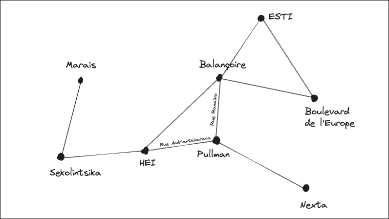
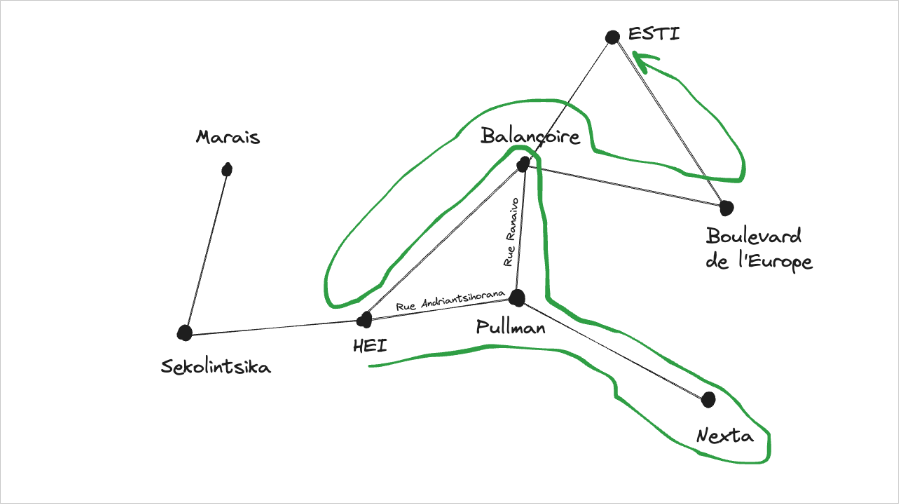
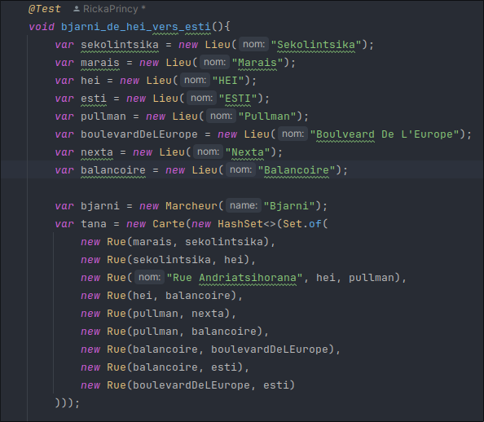
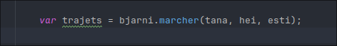
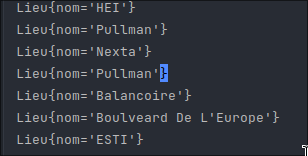
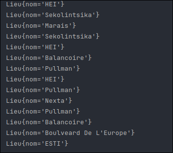
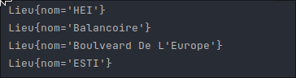

# WayGuesser (Randomly) (with French code)

## Imagine this map

You are at the **hei** position, you are trying to go to the **esti** position, 
but the problem is that `you don't know any way` to get there. 

Therefore, you have to try all possible ways randomly. 
Of course, you will not go through a path that you have already taken, and none of the worst paths.

This is one possible example:

# In java

# Guess one way

# Solution generated randomly

Of course, there are other ways to go through the destination.

# Source
# HEI (https://github.com/hei-school)